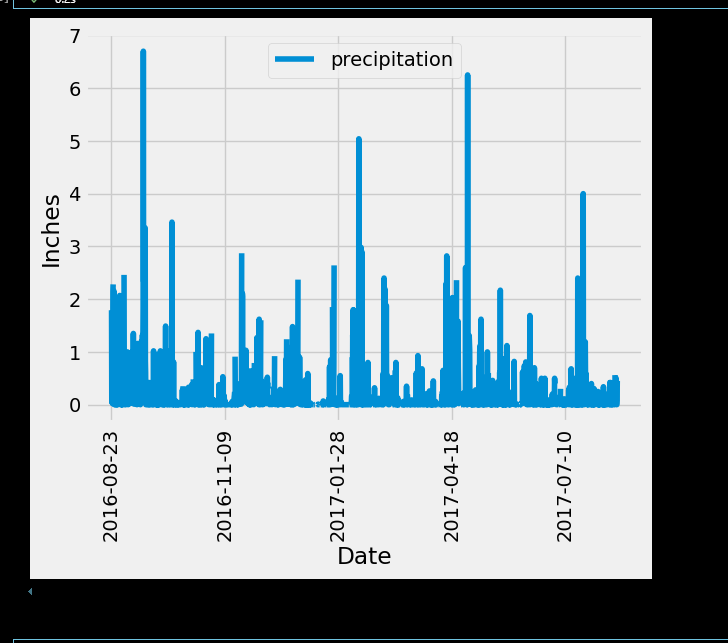
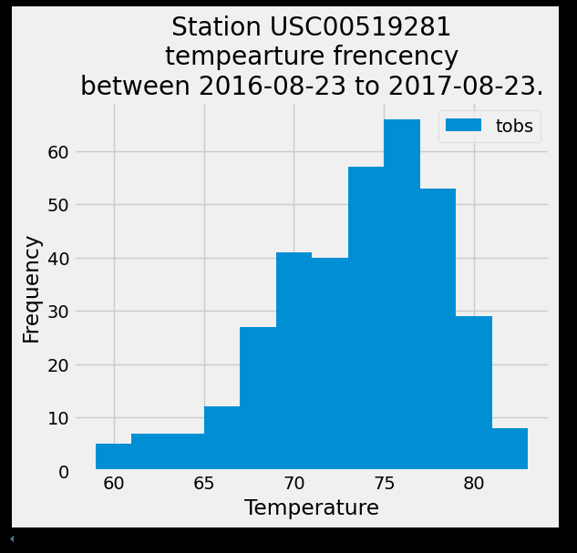
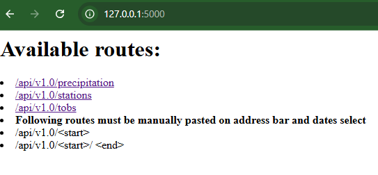
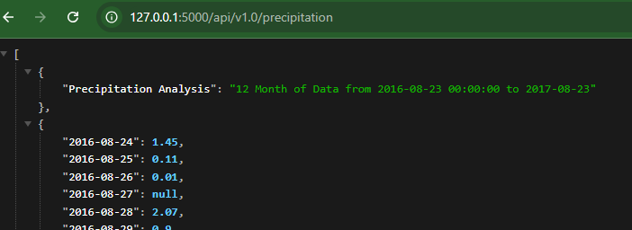
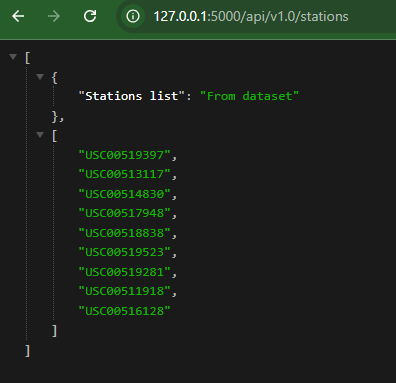
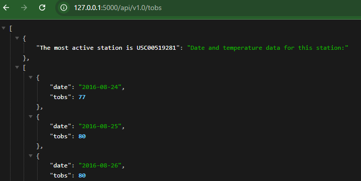
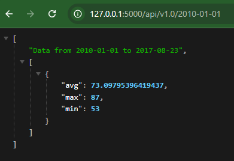
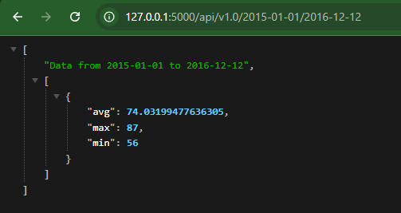

# Project sqlalchemy-challene
---
---
## Using python and SQLAlchemy for baxi climate analysis and data exploration

`Part ONE`
* Step one
    - Setup engine  to SQLite datebase .
    - Reflect tables into new models and save references to classes named station and measurement
    - Create session from python to the DB
    ---

* Step two(Exloratory Precipitation Analysis)
    - Finding most recent date in dataset
    - Query date and precipitation data for 12 months before most recents date in dataset.
    -Load query result into a Panda DataFrame
    - Plot DataFrame Create.

    - 

---

* Step three(Station Analysis)

    - Find number of station in dataset.

    - Find the most active station.

    -   The most active station is: USC00519281

    - Query most active station temparute for the previous 12 months.

    - Plot result in a histogram

    - 

---
---
 
 
 `Part two`

 * Create Flask API based on the queries from _Part one_ 
    - route one: /

    Homepage with list of all available routes.
    

    - route two: /api/v1.0/precipitation

    JSON representation of date and precipitation for 12 months data in dataset.
    

    - route three: /api/v1.0/stations

    List of station from dataset.
    
    

    - route four: /api/v1.0/tobs

    List of temperature observations for the previous year.
    

    -route five: /api/v1.0/`<start>`

    Shows minimun temperature , the average temperature and maximun temperature  for  a specified start date that user can manually choose.
    
    

    -router six: /api/v1.0/`<start>/<end>`
    Shows minimun temperature , the average temperature and maximun temperature  for  a specified start date and end date, that user can manually choose.
    
     

